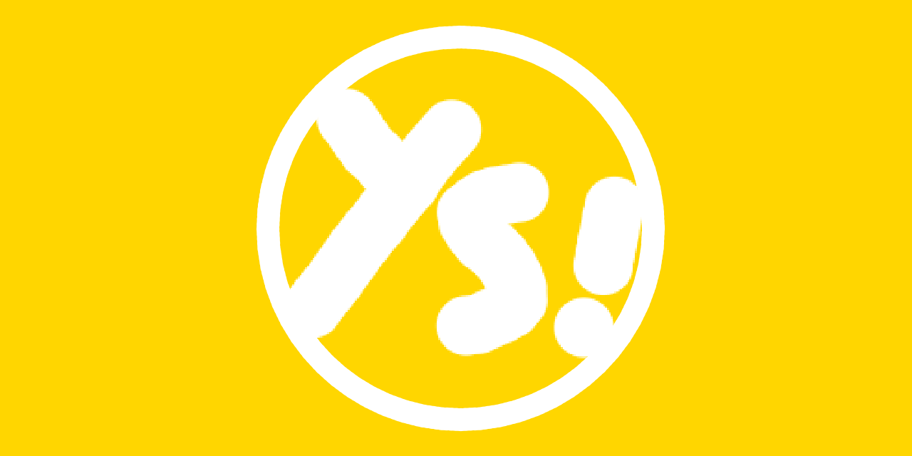
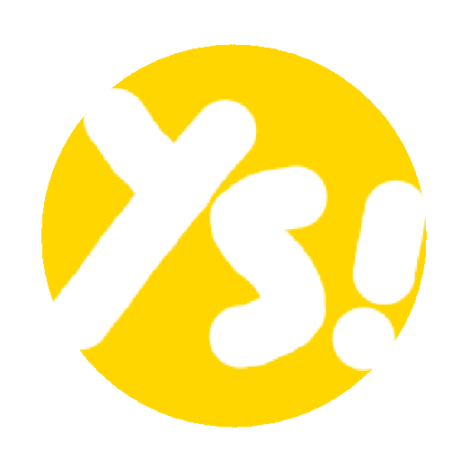

  

  
  
  
  

 

<h1 align="center">
  YASOS
  
</h1>
## What is yasos?
The yasos is a new language, but a the same time is the compiler for this language. It is a project with learning purpuoses to learn more about
compilers and how our machines understand our codes.

> This project is barely advanced and it is not recommended to use in a mid-advanced project, it is usable in examples or even easy learning about low level programming languages

# Documentation
To see the docs, visit: https://damechocolateya.github.io/yasos/

## How to compile the project?

You can use the installation script, just excute it with the `--install` flag
You can also use it to uninstall.

> This may require root privileges

## License

This project is licensed under the BSD 3-Clause License - see the [LICENSE](LICENSE) file for details.
